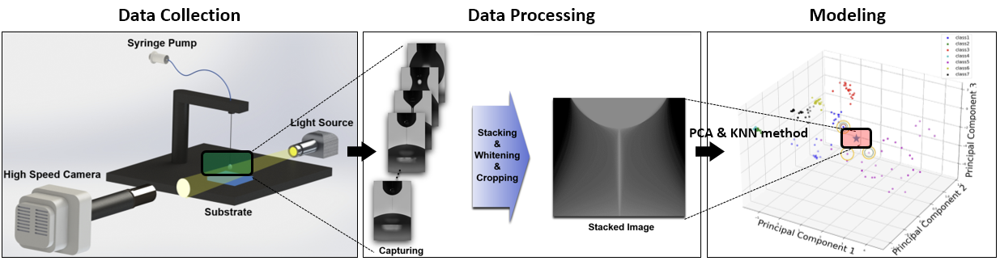

# Code Availability

## Over view

* **Step1. Data Collection**: In this step, we measure and load the Fluid Thinning video images, extracting only the necessary images.
* **Step2. Data Processing**: Through processes such as whitening, cropping, and stacking, we create Merge Images. We also utilize Data Augmentation to increase the amount of data.
* **Step3. Model Training**: In this step, we use PCA and KNN methods to train the model for predicting fluid concentration.
* **Step4. Model Validation**: Using the Mean Squared Error (MSE) method, we determine hyperparameters like PCs (Principal Components), k, weights, and frames.
* **Step5. Model Testing**: Finally, we use the Test Data to predict fluid concentration using the trained model.

## Step1. Data Collection
The first step involves loading the acquired video data using the DoS-CaBER method, as described in the Introduction of our [paper](https://epicgit.snu.ac.kr/ttackpool/paper_minhyuckim_eigen_thinning/-/blob/main/sn-article.pdf). This step is executed through the dos.py file. The video frames are retrieved sequentially using `DoSCaBERExperiment.get_nth_image`. The frames where fluid thinning occurs and fluid pinch-off is observed are identified using the `DoSCaBERExperiment.capbridge_start` and `DoSCaBERExperiment.capbridge_broken` methods, respectively. For this study, we utilize these two frames and the frames in between them.

## Step2. Data Processing
The second step involves preprocessing the previously acquired image data into a format suitable for model construction. In this paper, two main data preprocessing methods were utilized. The first method aims to obtain Merge Images representing fluid thinning. This process is executed through the dos.py file, utilizing `DoSCaBERExperiment.Image_storage` . Within this method, the images are first whitened using the OpenCV library to enhance their features. Subsequently, cropping is applied based on the structural characteristics of the images to remove unnecessary data and align the images' centers. Each frame is then transformed, with white pixels being set to 255 divided by the total number of frames, and all frames are combined into a single image. Through this process, the fluid thinning video is consolidated into a single image. Additionally, weights are assigned to the images at the pinch-off points, as described in the Results and Discussion section of this paper and illustrated in Fig. 8 and Fig. 9.

The second data preprocessing method involves augmenting the image data. This process is executed through the `PCA.py` file in the [PCA]((https://epicgit.snu.ac.kr/ttackpool/code-availability.git)) directory, utilizing `PCA.pcaclass.augmentation`. This method represents a novel Fluid Thinning Augmentation approach implemented using PCA in this paper. It involves multiplying random ratios to the PCA scores corresponding to each PC, applying transformations, and then reconstructing the images. This results in slightly altered images based on the PCs. Image augmentation has been shown to enhance the accuracy of the model.

## Step3. Model Training
The third step involves training a machine learning model to predict the concentration of mixed fluids. This step is executed through the `PCA.py` file in the [PCA]((https://epicgit.snu.ac.kr/ttackpool/code-availability.git)) directory. The concentration prediction model is constructed using `PCA.pcaclass.eigen`(Note: The method name may need modification for accuracy). The primary library utilized in this process is scikit-learn. Specifically, the `sklearn.decomposition.PCA` is applied for dimensionality reduction and noise removal, using PCA as one of the techniques. Subsequently, with the data processed by PCA, `sklearn.decomposition` and `sklearn.neighbors.KNeighborsClassifier` methods are employed to create a fluid concentration prediction model based on the K-Nearest Neighbors (KNN) algorithm.

## Step4. Model Validation
The fourth step involves the validation phase to determine hyperparameters for improving the model's accuracy. This process is performed using `PCA.pcaclass.eigen_validation method (Note: The method name may need modification for accuracy)`. In our model, the method for calculating fluid concentration is explained in the Results and discussion section of the [paper](https://epicgit.snu.ac.kr/ttackpool/paper_minhyuckim_eigen_thinning/-/blob/main/sn-article.pdf). The `knn.predict_proba` is utilized to calculate the probabilities corresponding to each class of the validation data. Based on these probabilities, the concentration of the validation data is predicted. The `Mean Squared Error (MSE)` is then computed by comparing the predicted values with the actual labels. In this process, the parameter k for the class determination in KNN is set to 6. This value is determined based on the characteristics of the fluid prediction model and the Eigen-thinning images of explainable PCs.
Next, an iterative calculation is performed for the number of PCs obtained through PCA, the number of frames used for providing weights, and the extent of weight given. Ultimately, the combination of PCs' count, frame count, and weight value resulting in the lowest MSE is selected. While this paper utilizes MSE to predict fluid concentration, the method for calculating predicted values may vary depending on the user's objectives, potentially leading to different hyperparameters for enhancing model accuracy.

## Step5. Model Testing
The fifth step involves the testing phase, where fluid concentration is predicted using the model. The `PCA.pcaclass.Ratio_plot` is utilized for this purpose. In this step, the determined PCs need to be input as parameters. As a result, the actual and predicted concentrations are represented as a Bar graph image.

